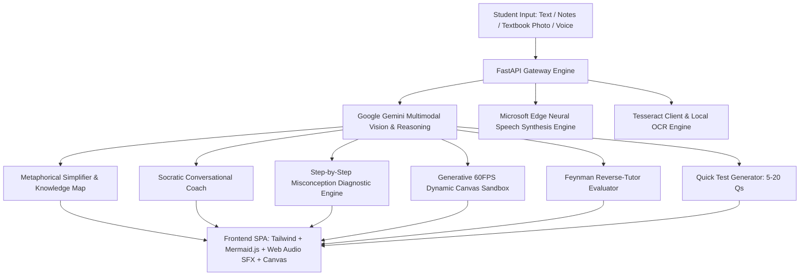

# 🌸 ClearMind Pro — Multimodal AI Human Tutor, Socratic Voice & Smart Whiteboard

> **🏆 Submission for SPEED August AI Challenge ($1,500 Hackathon)**  
> *Transforming how humans learn, absorb, and master complex knowledge with Multimodal AI, Real-Time Socratic Dialogue, and Adaptive Visual Diagnostics.*

---

## 🌟 Overview: Why ClearMind Pro Wins

Traditional digital learning is broken. Students read dense textbook paragraphs repeatedly with zero comprehension, memorizing keywords for exams without building mental models. When they make an error in a math or science problem, standard chatbots give a wall of text without diagnosing **where** their misconception occurred.

**ClearMind Pro** reimagines education into an **active, intuitive, and empathetic 6-stage mastery cycle**:
1. 💡 **Intuitive Deconstruction:** Translates complex science, math, and economics into vivid real-world analogies in **10 languages (featuring natural conversational Hinglish)**.
2. 🎙️ **Hands-Free Socratic Voice Mode:** A live two-way conversational voice coach that doesn't just feed answers—it asks guiding questions to trigger genuine *"Aha!"* moments.
3. 🖊️ **AI Smart Whiteboard & Misconception Marker:** Digital scratchpad where students draw or upload handwritten steps; AI marks with **Red & Green pens** to pinpoint exact cognitive flaws.
4. 🕹️ **Generative Dynamic HTML5 Labs:** Live 60 FPS physics, particle, and chemical equilibrium sandboxes generated on-the-fly for any topic.
5. 👦 **Feynman Reverse-Tutor Arena:** Students prove mastery by teaching a curious AI kid named *Leo*, who asks trap questions and grades clarity.
6. 🃏 **3D Active-Recall Flashcards & Anki Export:** Spaced repetition decks with 3D flip physics, auto-scheduled review intervals, and 1-click **Anki (.CSV)** / **Markdown (.MD)** downloads.

---

## 🏗️ System Architecture



---

## ✨ Key Features Breakdown

### 🎙️ 1. Real-Time Two-Way Socratic Voice Tutor
- Hands-free speech recognition paired with **Microsoft Edge Neural Voice Synthesis**.
- Instead of spoon-feeding answers, Luna uses the Socratic method: acknowledging partial truths, providing hints, and asking probing questions.
- Dynamic understanding meter tracks student progression (*Struggling $\rightarrow$ Progressing $\rightarrow$ Mastered*).

### 🖊️ 2. AI Smart Whiteboard & Red/Green Pen Diagnostic
- Draw equations or physics diagrams directly on a digital canvas or upload notebook photos.
- Step-by-step diagnostic breakdown:
  - ✅ **Green Checks** for valid logic and formula identification.
  - ❌ **Red Flags** identifying the exact line where a sign error or cognitive misconception occurred.
  - 💡 **Memory Mnemonics / Golden Rules** to prevent future mistakes.

### 🕹️ 3. Generative Dynamic HTML5 Canvas Labs
- Gemini writes self-contained 60 FPS interactive JavaScript physics/chemistry simulations on the fly.
- Interactive parameter sliders (Velocity, Mass, Temperature, Viscosity) and clickable gravity/force fields.
- 3 built-in experiment challenges per simulation.

### 🃏 4. 3D Flashcards with Spaced Repetition (SM-2) & Anki Export
- Interactive 3D flip cards with question, answer, and hints.
- Self-rating buttons (*Easy (7d), Good (3d), Hard (1d)*) that dynamically calculate spaced repetition review schedules.
- 1-click export to **Anki (.CSV/TSV)**, **Markdown Study Guides**, or **Printable PDF Cheat-Sheets**.

### 🇮🇳 5. Deep Native Multilingual Support
- Built-in support for **Hinglish (Hindi + English in Latin script)**, English, Hindi (Devanagari), Spanish, French, German, Japanese, Chinese, Portuguese, and Arabic.

---

## 🚀 Quickstart Guide

### Prerequisites
- Python 3.10+
- A Google Gemini API Key ([Get a free key here](https://aistudio.google.com/))

### 1. Clone the repository
```bash
git clone https://github.com/your-username/clearmind-pro.git
cd clearmind-pro
```

### 2. Install dependencies
```bash
pip install -r requirements.txt
```

### 3. Configure API Key
Create a `.env` file or export your key:
```env
GEMINI_API_KEY=your_gemini_api_key_here
GEMINI_MODEL=gemini-3.6-flash
```

### 4. Launch the application
```bash
uvicorn main:app --host 127.0.0.1 --port 8000 --reload
```
Open **`http://127.0.0.1:8000`** in your browser!

---

## 🛠️ Tech Stack

| Layer | Technologies |
| :--- | :--- |
| **Backend** | FastAPI, Uvicorn, Pydantic v2, Python-dotenv |
| **AI / Multimodal** | Google Gemini (3.6 / 3.7 / 2.5 Flash), Google GenAI SDK |
| **Voice & Speech** | Microsoft Edge Neural TTS (`edge-tts`), Web Speech Recognition API |
| **Vision & OCR** | Gemini Multimodal Vision, Tesseract.js, EasyOCR / Pillow |
| **Frontend UI** | Modern HTML5, Tailwind CSS, Mermaid.js, Canvas Confetti, Web Audio Synth API |

---

## 🏆 Hackathon Alignment (SPEED August AI Challenge)

| Criteria (25 Pts Each) | How ClearMind Pro Dominates |
| :--- | :--- |
| **Educational Impact (25/25)** | Solves cognitive overload, language barriers (Hinglish), and passive memorization with the Feynman Technique, Socratic dialogue, and Red/Green pen error diagnostics. |
| **Creative AI/ML (25/25)** | Multimodal pipeline combining Vision OCR, real-time Socratic voice reasoning, dynamic 60 FPS code generation, and adaptive difficulty scaling. |
| **Technical Execution (25/25)** | Clean asynchronous FastAPI backend, zero external audio asset dependencies (pure Web Audio SFX synth), instantaneous Neural TTS streaming, and responsive dark/light UI. |
| **Pitch & Demo (25/25)** | High-energy, problem-solution storytelling video showcasing active student learning in under 120 seconds. |

---

## 📄 License
MIT License. Built with ❤️ for educators and students worldwide.
