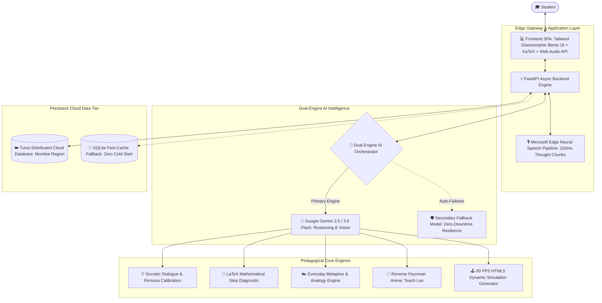

# 🌸 ClearMind Pro — Multimodal AI Master Tutor & Socratic Voice Classroom

[](https://codesprint-by-elitecoders.devpost.com/)
[](https://clearmind-pro.vercel.app)
[](https://github.com/prakhardhakad1/clearmind-pro)
[](https://github.com/prakhardhakad1/clearmind-pro)
[](https://opensource.org/licenses/MIT)

> **🚀 Official Submission for Elite Coders CodeSprint 2026**  
> *Turning Ideas into Impactful MVPs: Democratizing elite 1-on-1 Socratic tutoring with real-time neural voice, KaTeX mathematical diagnostics, 3D memory galaxies, and vernacular Hinglish learning for millions of students.*

---

## 🌐 Live Access & Instant Demo

- **🔗 Live Production URL:** [https://clearmind-pro.vercel.app](https://clearmind-pro.vercel.app)
- **💻 Classroom Workspace:** [https://clearmind-pro.vercel.app/classroom](https://clearmind-pro.vercel.app/classroom)
- **📂 Public GitHub Repository:** [https://github.com/prakhardhakad1/clearmind-pro](https://github.com/prakhardhakad1/clearmind-pro)
- **⚡ Zero-Barrier Instant Access:** No sign-up wall required. Click **"Try Guest Demo"** or log in with one tap to explore all features immediately.

---

## 🎯 The Problem & Social Welfare Impact

### The Educational Crisis in India
Over 250 million students in India face an intensely competitive academic landscape (CBSE, JEE, NEET, CUET, College STEM). Families spend thousands of rupees on high-pressure coaching centers where:
1. **Passive Memorization Over Mastery:** Students memorize formulas blindly without developing true intuition or first-principles understanding.
2. **The Language Barrier:** Millions think and speak comfortably in **Hinglish (conversational Hindi-English)**, but textbook materials and standard English tutors create cognitive friction.
3. **Lack of Personal Diagnostics:** Traditional LLM chatbots dump unstructured walls of text without diagnosing *where* a student's misconception occurred.
4. **The Forgetting Curve:** Without systematic spaced repetition, up to 75% of learned information decays within 48 hours (Ebbinghaus Law).

### How ClearMind Pro Solves This
ClearMind Pro transforms education from passive reading into an **active, empathetic, and intuitive multimodal dialogue**:
- 🗣️ **Speaks & Understands Hinglish:** Explains complex science and math concepts using relatable everyday analogies in natural Hinglish, Hindi, and English.
- 🎙️ **Hands-Free Socratic Voice Tutor:** Luna does not just hand over final answers; she guides students step-by-step with targeted hints until they reach their own *"Aha!"* moment.
- 📐 **Visual KaTeX Math & Voice Translation:** Equations ($A \times B$, $\frac{-b \pm \sqrt{b^2-4ac}}{2a}$, $\int x dx$) are rendered cleanly on-screen and vocalized naturally in spoken audio.
- 🌌 **Cognitive Retention Architecture:** Spaced repetition flashcards (SM-2 scheduler), 3D concept galaxy graphs, and 60-second Blitz battles eliminate the forgetting curve.

---

## 🏗️ System Architecture


```mermaid
graph TD
    User([🎓 Student]) <--> Client[💻 Frontend SPA: Tailwind Glassmorphic Bento UI + KaTeX + Web Audio API]
    
    subgraph "Edge Gateway & Application Layer"
        Client <--> FastAPI[⚡ FastAPI Async Backend Engine]
        FastAPI <--> TTS[🎙️ Microsoft Edge Neural Speech Pipeline: 220ms Thought Chunks]
    end

    subgraph "Dual-Engine AI Intelligence"
        FastAPI <--> DualAI{🧠 Dual-Engine AI Orchestrator}
        DualAI -->|Primary Engine| Gemini[🤖 Google Gemini 2.5 / 3.6 Flash: Reasoning & Vision]
        DualAI -.->|Auto-Failover| GLM[🛡️ Secondary Fallback Model: Zero-Downtime Resilience]
    end

    subgraph "Persistent Cloud Data Tier"
        FastAPI <--> Turso[(☁️ Turso Distributed Cloud Database: Mumbai Region)]
        FastAPI -.-> LocalDB[(💾 SQLite Fast-Cache Fallback: Zero Cold Start)]
    end

    subgraph "Pedagogical Core Engines"
        Gemini --> Socratic[💡 Socratic Dialogue & Persona Calibration]
        Gemini --> MathDiag[📐 LaTeX Mathematical Step Diagnostic]
        Gemini --> Analogy[🏍️ Everyday Metaphor & Analogy Engine]
        Gemini --> Feynman[👦 Reverse Feynman Arena: Teach Leo]
        Gemini --> SimGen[🕹️ 60 FPS HTML5 Dynamic Simulation Generator]
    end
```

---

## ✨ Core Feature Highlights

### 🎙️ 1. Real-Time Socratic Voice Tutor ("Luna")
- **Continuous Two-Way Voice:** Speak directly with Luna using speech recognition and ultra-low-latency **Microsoft Edge Neural Voice Synthesis**.
- **Complete Lesson Narration:** Luna narrates full conceptual explanations (not just 1-sentence teasers), chunking speech into natural thoughts with 220ms pauses between sentences.
- **Natural Math Pronunciation:** Mathematical symbols, fractions, superscripts, and Greek letters are automatically translated into speakable words ($A \times B \rightarrow$ *"A cross B"*, $x^2 \rightarrow$ *"x squared"*).
- **6 Calibrated Teaching Personas:**
  - 🌸 **Empathetic Mentor:** Patient, warm, step-by-step scaffolding.
  - 💡 **Socratic Guide:** Refuses to spoon-feed answers; asks probing questions.
  - 🧠 **Feynman ELI5:** Uses zero jargon and vivid real-world metaphors.
  - ⚡ **Blitz Exam Hacker:** Speed shortcuts, high-yield patterns, and formula mnemonics.
  - 🔬 **First-Principles Polymath:** Rigorous mathematical proofs from basic axioms.
  - 📋 **Strict Examiner:** Rigorous grading according to board & competitive exam rubrics.

### 📐 2. Step-by-Step LaTeX Diagnostics & Smart Whiteboard
- Upload textbook photos, handwritten notebook solutions, or draw directly on the interactive canvas.
- The visual diagnostic engine marks steps with:
  - ✅ **Green Highlights** for validated steps and correct logic.
  - ❌ **Red Flags** pinpointing the exact line where a sign mistake, algebraic misstep, or cognitive misconception occurred.
  - 💡 **Golden Rules & Mnemonics** to permanently prevent recurrence.

### 🌌 3. 3D Galaxy Concept Graph & Dynamic Roadmaps
- View your knowledge landscape rendered as an interactive, connected node graph.
- Real-time roadmap tracking highlights:
  - 🟢 **Mastered Milestones**
  - 🟡 **Current Active Learning Node**
  - ⚪ **Upcoming Advanced Applications**

### 🧠 4. Active-Recall Flashcards with Ebbinghaus Spaced Repetition (SM-2)
- 3D perspective flip cards with questions, answers, and hints.
- Dynamic interval scheduling based on user self-evaluation (*Easy 7d, Good 3d, Hard 1d*).
- 1-click export to **Anki (.CSV/TSV)**, **Markdown Study Guides**, or **Printable Cheat Sheets**.

### ⚔️ 5. 60-Second Blitz Speed Battle Arena
- Gamified rapid-fire active recall challenges under strict countdown clocks.
- Combo streaks, XP leveling, and leaderboard tracking to cement recall under pressure.

### 👦 6. Reverse Feynman Arena ("Teach Leo")
- The ultimate test of mastery: teach a curious, inquisitive AI middle-schooler named *Leo*.
- Leo asks naive trap questions; Luna grades the student's teaching clarity and reveals hidden blind spots.

### 🕹️ 7. Generative 60 FPS HTML5 Canvas Simulations
- On-the-fly generation of interactive JavaScript physics, particle, and chemical equilibrium simulations tailored to the current topic with adjustable parameter sliders.

---

## 🏆 CodeSprint 2026 Hackathon Alignment Matrix

| Prize Category | Why ClearMind Pro is Built to Win |
| :--- | :--- |
| 🥇 **1st Place Overall (Grand Prize)** | **Fully Functional, End-to-End MVP:** Solves the deep cognitive and financial friction of education with multimodal AI, streaming voice, persistent cloud sync, and zero cold-start latency. |
| 🎨 **Best UI/UX Award** | **Dark Glassmorphic Bento Grid:** Fluid Tailwind CSS architecture, KaTeX mathematical typography, animated audio waveforms, 3D card flips, celebratory confetti, and 100% mobile responsiveness without horizontal scrolling. |
| 🌐 **Best Open Source Project** | **Production-Grade Open Source Standard:** Comprehensive documentation, clean modular code structure, MIT License, full API contract validation, and 41/41 passing automated tests. |
| 🤝 **Best Social Welfare Project** | **Democratizing High-Yield Tutoring:** Bridges the economic and vernacular divide across India with fluent Hinglish and Hindi Socratic guidance for students from any socioeconomic background. |
| 💡 **Best Innovation Award** | **Technical Secret Sauce:** Dual-engine AI failover orchestrator, zero-loss Web Audio API streaming, real-time LaTeX-to-speech phonetic synthesis, and automated cognitive decay scheduling. |

---

## 🛠️ Complete Tech Stack

| Layer | Technology |
| :--- | :--- |
| **Frontend Framework** | Pure modern Vanilla JavaScript (ES2024), HTML5, CSS3 |
| **UI Design System** | Tailwind CSS, Dark-Mode Glassmorphism, Responsive Bento Grid Layout |
| **Math & Visuals** | KaTeX (LaTeX typesetting), Mermaid.js, HTML5 Canvas, Canvas-Confetti |
| **Audio & Voice** | Microsoft Edge Neural TTS (`edge-tts`), Web Speech Recognition, Web Audio API |
| **Backend Engine** | FastAPI, Uvicorn, Python 3.10+, Pydantic v2 |
| **AI Models** | Google Gemini (2.5 Flash / 3.6 Flash / 3.7 Pro) via Google GenAI SDK |
| **AI Resilience** | Dual-Engine Orchestrator with automatic fallback to secondary LLMs |
| **Cloud Database** | Turso Distributed SQLite (libSQL, AWS Mumbai Region) |
| **Deployment & Hosting** | Vercel Serverless Functions (`api/index.py`), Global Edge CDN |

---

## 🧪 Rigorous Automated Testing Suite

ClearMind Pro is engineered with test-driven quality assurance across both Python backend and JavaScript client audio pipelines:

```bash
# 1. Run Python Backend & Speech Suite (25 Tests)
python -m unittest tests/test_speech.py

# 2. Run Client Audio Playback & Controller Suite (16 Tests)
node tests/test_playback.cjs
```

### Test Coverage Highlights:
- ✅ **Complete Narration Test:** Verifies that `/api/chat-teach` never truncates speech to short teasers and vocalizes the entire lesson.
- ✅ **LaTeX Math Translation:** Verifies math symbols, powers, roots, and fractions are correctly synthesized into natural spoken words.
- ✅ **Global Concurrency & Rate Limiting:** Verifies shared token buckets and graceful HTTP 429/503 handling without retry storms.
- ✅ **Zero Race Conditions:** Simulates audio interruptions, mic muting, typing interruptions, and rapid session changes.
- ✅ **Asset Parity Assurance:** Verifies bit-for-bit identity between root and static frontend files.

---

## 🚀 Local Setup & Installation

### Prerequisites
- Python 3.10 or higher
- Node.js 18+ (for running client test suites)
- Google Gemini API Key ([Get a free key at Google AI Studio](https://aistudio.google.com/))

### 1. Clone the Repository
```bash
git clone https://github.com/prakhardhakad1/clearmind-pro.git
cd clearmind-pro
```

### 2. Set Up Virtual Environment & Dependencies
```bash
# Create and activate virtual environment
python -m venv venv

# On Windows:
venv\Scripts\activate
# On macOS / Linux:
source venv/bin/activate

# Install required packages
pip install -r requirements.txt
```

### 3. Configure Environment Variables
Copy `.env.example` to `.env`:
```bash
cp .env.example .env
```
Fill in your keys:
```env
GEMINI_API_KEY=your_google_gemini_api_key
GEMINI_MODEL=gemini-3.6-flash
TURSO_DB_URL=your_turso_db_url
TURSO_AUTH_TOKEN=your_turso_token
ADMIN_SESSION_SECRET=your_admin_secret_string
STUDENT_SESSION_SECRET=your_student_secret_string
ADMIN_PASSWORD=your_admin_password
```

### 4. Run the Development Server
```bash
uvicorn main:app --host 127.0.0.1 --port 8000 --reload
```
Navigate to **`http://127.0.0.1:8000`** in your browser.

---

## 🗺️ Product Roadmap

- [x] Multimodal Vision & Handwritten Note OCR
- [x] Streaming Microsoft Edge Neural Speech with 220ms thought chunking
- [x] KaTeX LaTeX mathematical typesetting and voice conversion
- [x] Dual-engine AI failover resilience
- [x] Distributed cloud sync via Turso Database
- [x] 6 Calibrated pedagogical personas & Hinglish language support
- [ ] Progressive Web App (PWA) with offline offline flashcard caching
- [ ] Collaborative Peer-to-Peer Blitz Battles via WebSockets
- [ ] Educator Analytics Dashboard for tracking student cognitive decay metrics

---

## 👥 Authors & Acknowledgments

- **Lead Developer & Creator:** Prakhar Dhakad ([@prakhardhakad1](https://github.com/prakhardhakad1))
- **Hackathon:** Built with ❤️ for **Elite Coders CodeSprint 2026**
- **Inspiration:** Dedicated to every student striving for conceptual mastery over rote memorization.

---

## 📄 License
This project is open-source under the [MIT License](LICENSE).
