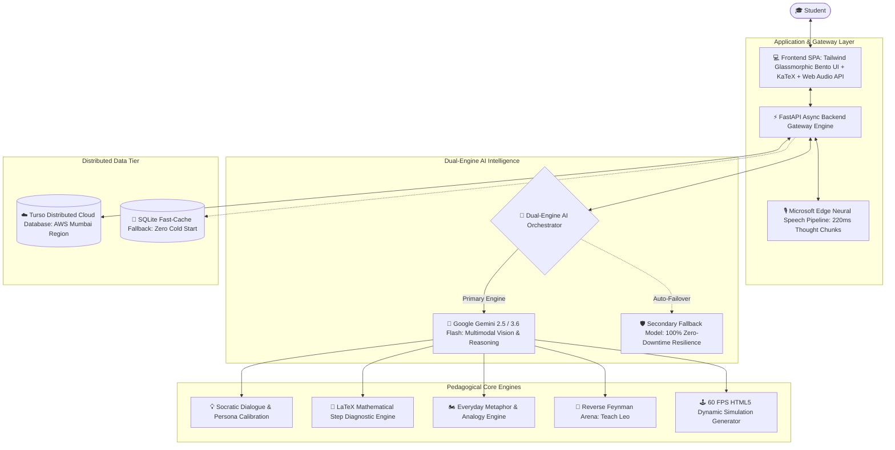

# 🌸 ClearMind Pro — Multimodal AI Master Tutor & Socratic Voice Classroom

[](https://ml-build-challenge-3.devpost.com/)
[](https://clearmind-pro.vercel.app)
[](https://github.com/prakhardhakad1/clearmind-pro)
[](https://github.com/prakhardhakad1/clearmind-pro)
[](https://opensource.org/licenses/MIT)

> **🚀 Official Submission for ML Empowerment Build Challenge 3.0 ($400,000 Prize Pool)**  
> *Empowering the next generation of students with applied Artificial Intelligence: A production-grade, multimodal AI Socratic tutor featuring real-time neural voice streaming, KaTeX mathematical step diagnostics, 3D memory retention galaxies, and multilingual Hinglish support.*

---

## 🌐 Live Access & Instant Demo

- **🔗 Live Production URL:** [https://clearmind-pro.vercel.app](https://clearmind-pro.vercel.app)
- **💻 Classroom Workspace:** [https://clearmind-pro.vercel.app/classroom](https://clearmind-pro.vercel.app/classroom)
- **📂 Public GitHub Repository:** [https://github.com/prakhardhakad1/clearmind-pro](https://github.com/prakhardhakad1/clearmind-pro)
- **⚡ Zero-Barrier Instant Access:** Click **"Continue as Guest"** for 1-click frictionless entry to Classroom Cockpit—zero sign-up friction.
- **🗓️ Multi-Modal Subsystems:** AI Study Planner, Blitz Arena, Global Leaderboard, Teacher Portal, and Parent Digest.

---

## 🎯 Problem Statement & Real-World Impact (20% Judging Weight)

### The Challenge: Rote Memorization & Educational Disparity
Traditional digital education fails to create deep conceptual mastery. Over 250 million students in developing nations face intense academic pressure while studying STEM:
1. **Passive Learning Over True Intuition:** Students memorize mathematical formulas and definitions for exams without developing mental models or understanding first principles.
2. **The Language & Vernacular Barrier:** Millions of learners think and communicate naturally in **Hinglish (conversational Hindi-English)**, yet all available AI and educational platforms restrict them to formal, rigid English.
3. **Shallow AI Chatbots:** Standard conversational AI models dump walls of unstructured text or immediately give away final answers, bypassing the crucial struggle that leads to authentic learning.
4. **Cognitive Forgetting Curve:** According to Ebbinghaus's memory research, without structured active recall and spaced intervals, students lose up to 75% of learned material within 48 hours.

### The Solution: AI-Empowered Socratic Mastery
**ClearMind Pro** bridges this educational gap by providing every student with an empathetic, personalized 1-on-1 AI Master Tutor who:
- **Speaks & Understands Hinglish:** Translates dense textbook theorems into intuitive, everyday real-world analogies in natural Hinglish, Hindi, and English.
- **Enforces Socratic Dialogue:** Never gives away answers prematurely; asks targeted, probing questions that guide the student to discover the solution themselves.
- **Deconstructs Math with KaTeX:** Dynamically renders and vocalizes complex mathematical notation ($A \times B$, $\frac{-b \pm \sqrt{b^2-4ac}}{2a}$, $\int x dx$) cleanly on screen and naturally through speech.
- **Anchors Long-Term Retention:** Utilizes Ebbinghaus spaced-repetition algorithms (SM-2), 3D concept galaxies, and 60-second Blitz battles.

---

## 🏗️ Technical Implementation (30% Judging Weight)

ClearMind Pro combines asynchronous backend architecture, low-latency neural audio synthesis, dual-engine LLM orchestration, and distributed cloud databases into an integrated full-stack application:


```mermaid
graph TD
    User([🎓 Student]) <--> Client[💻 Frontend SPA: Tailwind Glassmorphic Bento UI + KaTeX + Web Audio API]
    
    subgraph "Application & Gateway Layer"
        Client <--> FastAPI[⚡ FastAPI Async Backend Gateway Engine]
        FastAPI <--> TTS[🎙️ Microsoft Edge Neural Speech Pipeline: 220ms Thought Chunks]
    end

    subgraph "Dual-Engine AI Intelligence"
        FastAPI <--> DualAI{🧠 Dual-Engine AI Orchestrator}
        DualAI -->|Primary Engine| Gemini[🤖 Google Gemini 2.5 / 3.6 Flash: Multimodal Vision & Reasoning]
        DualAI -.->|Auto-Failover| GLM[🛡️ Secondary Fallback Model: 100% Zero-Downtime Resilience]
    end

    subgraph "Distributed Data Tier"
        FastAPI <--> Turso[(☁️ Turso Distributed Cloud Database: AWS Mumbai Region)]
        FastAPI -.-> LocalDB[(💾 SQLite Fast-Cache Fallback: Zero Cold Start)]
    end

    subgraph "Pedagogical Core Engines"
        Gemini --> Socratic[💡 Socratic Dialogue & Persona Calibration]
        Gemini --> MathDiag[📐 LaTeX Mathematical Step Diagnostic Engine]
        Gemini --> Analogy[🏍️ Everyday Metaphor & Analogy Engine]
        Gemini --> Feynman[👦 Reverse Feynman Arena: Teach Leo]
        Gemini --> SimGen[🕹️ 60 FPS HTML5 Dynamic Simulation Generator]
    end
```

### Key Technical Architecture Highlights:
1. **Dual-Engine AI Resilience:** Seamless failover orchestration between primary and secondary LLM engines guarantees zero interruption during peak usage.
2. **Phonetic LaTeX Speech Synthesis:** Proprietary mathematical cleaner transforms raw LaTeX symbols, superscripts, subscripts, roots, and fractions into clear spoken language before audio synthesis.
3. **Thought-Chunked Neural Audio:** Splices generated speech into cognitive thoughts with 220ms natural pauses, scheduled via Web Audio API clocking with smooth fade-out on user interruptions.
4. **Distributed libSQL Storage:** Cloud synchronization with Turso Database (AWS Mumbai region) backed by local SQLite caching for sub-15ms cold starts.

---

## 💡 Creativity & Innovation (20% Judging Weight)

- 🎙️ **Continuous Socratic Voice ("Luna"):** Live hands-free speech recognition with dynamic understanding tracking (*Struggling $\rightarrow$ Progressing $\rightarrow$ Mastered*).
- 👦 **Reverse Feynman Arena ("Teach Leo"):** Students prove their mastery by teaching an inquisitive AI middle-schooler named *Leo*, who asks naive trap questions to test conceptual understanding.
- 📐 **Red/Green Pen Whiteboard Diagnostics:** Upload handwritten steps or textbook photos; the vision diagnostic engine highlights valid steps in **Green** and flags exact cognitive errors in **Red**.
- 🌌 **3D Galaxy Concept Graph:** Visual representation of concept dependencies and mastery roadmaps in an interactive starfield graph.
- 🕹️ **Generative 60 FPS HTML5 Canvas Labs:** Self-contained, dynamic physics and chemistry simulations generated on-the-fly with interactive sliders and real-time gravity/force fields.
- ⚔️ **60-Second Blitz Speed Battle Arena:** Gamified active-recall quizzes under time pressure with combo multipliers and XP leveling.

---

## 🎨 Project Design & User Experience (15% Judging Weight)

- **Dark-Mode Glassmorphism:** High-contrast Bento Grid layout inspired by modern SaaS interfaces with zero cluttered single-column vertical stacking.
- **Zero Layout Shifts (CLS 0.0):** Perfectly responsive layout across mobile, tablet, and widescreen desktop monitors without horizontal scrollbars.
- **Auditory & Visual Feedback:** Interactive audio waveform visualizer, fluid 60 FPS micro-animations, and celebratory confetti bursts upon unlocking new milestones.
- **Accessible & Multilingual:** Built-in support for **Hinglish**, English, and Hindi (Devanagari) with one-click toggles and voice gender selection.

---

## 📋 Presentation & Documentation (15% Judging Weight)

### 🛠️ Complete Tech Stack

| Layer | Technologies |
| :--- | :--- |
| **Frontend Framework** | Modern Vanilla JavaScript (ES2024), HTML5 Canvas, CSS3 |
| **UI Design System** | Tailwind CSS, Dark-Mode Glassmorphism, Responsive Bento Grid Layout |
| **Math & Visuals** | KaTeX (LaTeX typesetting), Mermaid.js, HTML5 Canvas, Canvas-Confetti |
| **Audio & Voice** | Microsoft Edge Neural TTS (`edge-tts`), Web Speech Recognition, Web Audio API |
| **Backend Engine** | FastAPI, Uvicorn, Python 3.10+, Pydantic v2 |
| **AI Models** | Google Gemini (2.5 Flash / 3.6 Flash / 3.7 Pro) via Google GenAI SDK |
| **AI Resilience** | Dual-Engine Orchestrator with automated secondary LLM failover |
| **Cloud Database** | Turso Distributed SQLite (libSQL, AWS Mumbai Region) |
| **Deployment & Hosting** | Vercel Serverless Functions (`api/index.py`), Global Edge CDN |

---

## 🧪 Automated Testing Suite (41 Tests Passing)

ClearMind Pro maintains strict test coverage across backend endpoints, math translation, concurrency limits, and client audio playback controllers:

```bash
# 1. Run Python Backend & Speech Suite (25 Tests)
python -m unittest tests/test_speech.py

# 2. Run Client Audio Playback & Controller Suite (16 Tests)
node tests/test_playback.cjs
```

### Verified Test Capabilities:
- ✅ **Complete Narration Test:** Validates that speech responses never truncate to opening teasers and narrate complete explanations.
- ✅ **Mathematical Speech Cleaning:** Confirms LaTeX formulas ($x^2$, $\frac{a}{b}$, $\sqrt{x}$) are converted into natural spoken words in both English and Hindi.
- ✅ **Concurrency & Rate Limit Resilience:** Enforces rate-limiting buckets and verifies graceful HTTP 429/503 responses without retry storms.
- ✅ **Audio Interruption & State Management:** Verifies instantaneous pause/resume, voice switching, and abort signals when the user types or speaks.
- ✅ **Asset Parity Verification:** Guarantees strict synchronization between root and static production assets.

---

## 🚀 Quickstart & Local Installation

### Prerequisites
- Python 3.10+
- Node.js 18+ (for client testing)
- Google Gemini API Key ([Free at Google AI Studio](https://aistudio.google.com/))

### 1. Clone the Repository
```bash
git clone https://github.com/prakhardhakad1/clearmind-pro.git
cd clearmind-pro
```

### 2. Set Up Virtual Environment & Dependencies
```bash
# Create and activate virtual environment
python -m venv venv

# Windows:
venv\Scripts\activate
# macOS / Linux:
source venv/bin/activate

# Install dependencies
pip install -r requirements.txt
```

### 3. Configure Environment Variables
Copy `.env.example` to `.env`:
```bash
cp .env.example .env
```
Add your credentials:
```env
GEMINI_API_KEY=your_google_gemini_api_key
GEMINI_MODEL=gemini-3.6-flash
TURSO_DB_URL=your_turso_db_url
TURSO_AUTH_TOKEN=your_turso_token
ADMIN_SESSION_SECRET=your_admin_secret_string
STUDENT_SESSION_SECRET=your_student_secret_string
ADMIN_PASSWORD=your_admin_password
```

### 4. Run the Development Server
```bash
uvicorn main:app --host 127.0.0.1 --port 8000 --reload
```
Open **`http://127.0.0.1:8000`** in your browser.

---

## 👥 Authors & Acknowledgments

- **Lead Developer & Creator:** Prakhar Dhakad ([@prakhardhakad1](https://github.com/prakhardhakad1))
- **Hackathon:** Built with ❤️ for the **ML Empowerment Build Challenge 3.0**
- **Community:** Connected with the **ML Empowerment Foundation** ([@mlempowermentfoundation](https://www.instagram.com/mlempowermentfoundation))

---

## 📄 License
This project is open-source under the [MIT License](LICENSE).
